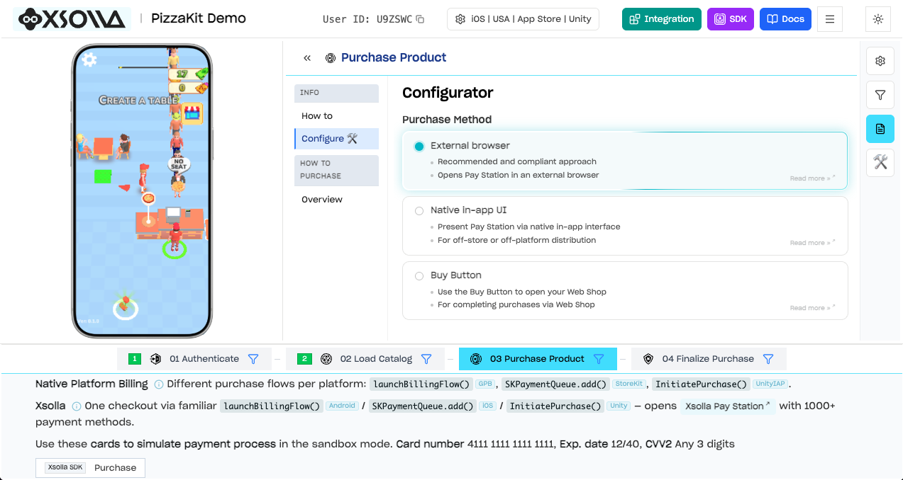

# Xsolla Mobile SDK for Android


[](https://www.oracle.com/java/)
[](https://developer.android.com)
[](https://gradle.org/)

Pre-built Android SDK for integrating in-game payments into your app via Xsolla Pay Station.

## SDK Explorer

See exactly how payments work before writing a single line of code. The SDK Explorer lets you walk through authentication, catalog loading, purchasing, and finalization — all in an interactive environment.

[](https://developers.xsolla.com/sdk/demo/)

[**Integrate Now →**](https://developers.xsolla.com/sdk/demo/)

## Essential Links

- [SDK Explorer](https://developers.xsolla.com/sdk/demo/) — interactive demo
- [SDK Documentation](https://developers.xsolla.com/sdk/) — full integration guide
- [Demo App](https://github.com/xsolla/xsolla-sdk-demo) — sample project

## Overview

Xsolla Mobile SDK provides a Google Play Billing-compatible API for in-game purchases via Xsolla Pay Station. It mirrors Google's Billing Library patterns (`BillingClient`, `ProductDetails`, `Purchase`) so integration feels familiar to Android developers.

**Key features:**

- 1000+ payment methods across 200+ geographies
- 130+ currencies including local and alternative payment methods
- Built-in anti-fraud protection
- 25+ languages supported out of the box
- Player authentication (Xsolla Login widget, social login, custom tokens)
- Product catalog and virtual items
- Buy Button and Web Shop integration

## Requirements

- Android API 24+
- Java 11+

## Installation

Add the Xsolla Maven repository to your `settings.gradle`:

```groovy
dependencyResolutionManagement {
    repositories {
        google()
        mavenCentral()

        maven {
            url "https://raw.githubusercontent.com/xsolla/xsolla-sdk-android/main"
        }
    }
}
```

Then add the dependency in your module's `build.gradle`:

```groovy
dependencies {
    implementation 'com.xsolla.android:mobile:3.0.52'
}
```

## Quick Start

### 1. Connect

Configure the SDK with your project credentials, set up a purchase listener (see step 4), and establish a billing connection:

```java
import com.xsolla.android.mobile.*;

int PROJECT_ID = 77640;
String LOGIN_ID = "026201e3-7e40-11ea-a85b-42010aa80004";

Config config = new Config(
    Config.Common.getDefault()
        .withSandboxEnabled(true),
    Config.Integration.forXsolla(
        Config.Integration.Xsolla.Authentication.forAutoJWT(
            ProjectId.parse(PROJECT_ID).getRightOrThrow(),
            LoginUuid.parse(LOGIN_ID).getRightOrThrow()
        )
    ),
    Config.Payments.getDefault(),
    Config.Analytics.getDefault()
);

BillingClient billingClient = BillingClient.newBuilder(context)
    .setListener(purchasesUpdatedListener)
    .setConfig(config)
    .build();

billingClient.startConnection(new BillingClientStateListener() {
    @Override
    public void onBillingSetupFinished(BillingResult billingResult) {
        if (billingResult.getResponseCode() == BillingClient.BillingResponseCode.OK) {
            // Ready to query products and make purchases
        }
    }

    @Override
    public void onBillingServiceDisconnected() {
        // Handle reconnection
    }
});
```

### 2. Load Catalog

Query your product catalog by SKU:

```java
List<QueryProductDetailsParams.Product> productList = Arrays.asList(
    QueryProductDetailsParams.Product.newBuilder()
        .setProductId("com.xsolla.crystals.10")
        .setProductType(BillingClient.ProductType.INAPP)
        .build()
    // ...more products
);

QueryProductDetailsParams params = QueryProductDetailsParams.newBuilder()
    .setProductList(productList)
    .build();

billingClient.queryProductDetailsAsync(params, (billingResult, productDetailsList) -> {
    if (billingResult.getResponseCode() == BillingClient.BillingResponseCode.OK) {
        // Store `productDetailsList` and use it to launch purchases (see step 3)
    }
});
```

### 3. Purchase

Use the product from your catalog to launch a purchase via Pay Station:

```java
// Use from `productDetailsList` (see step 2)
ProductDetails product = productDetailsList.get(0);

BillingFlowParams flowParams = BillingFlowParams.newBuilder()
    .setProductDetailsParamsList(Collections.singletonList(
        BillingFlowParams.ProductDetailsParams.newBuilder()
            .setProductDetails(product)
            .build()
    ))
    .build();

billingClient.launchBillingFlow(activity, flowParams);
```

### 4. Finalize

Handle completed transactions in your `PurchasesUpdatedListener` and consume each purchase:

```java
PurchasesUpdatedListener purchasesUpdatedListener = (billingResult, purchases) -> {
    if (billingResult.getResponseCode() == BillingClient.BillingResponseCode.OK && purchases != null) {
        for (Purchase purchase : purchases) {
            // Award the product to the user, then consume
            ConsumeParams consumeParams = ConsumeParams.newBuilder()
                .setPurchaseToken(purchase.getPurchaseToken())
                .build();

            billingClient.consumeAsync(consumeParams, (result, purchaseToken) -> {
                // Purchase consumed
            });
        }
    }
};
```

> For the full integration guide, see the [SDK Documentation](https://developers.xsolla.com/sdk/).

## Support

- **GitHub Issues:** [github.com/xsolla/xsolla-sdk-android/issues](https://github.com/xsolla/xsolla-sdk-android/issues)
- **Developer portal:** [developers.xsolla.com](https://developers.xsolla.com)

## License

Apache 2.0 License. See [LICENSE](./LICENSE).
